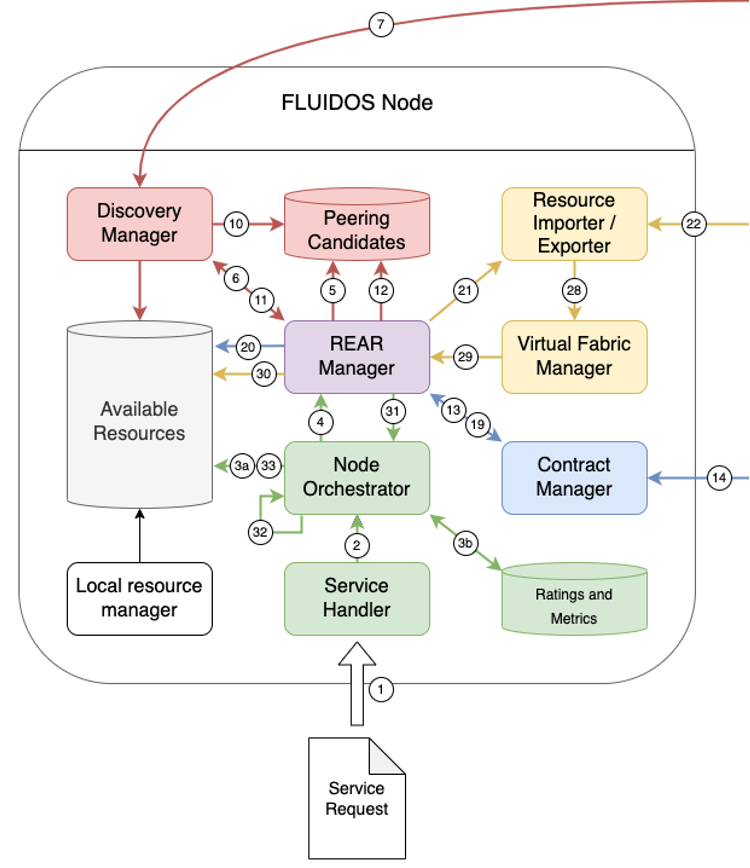

# Intent-based Computing Continuum

A list of works and implementation related to this activity is the following:
- [Model-Based Meta-Orchestrator](https://github.com/fluidos-project/fluidos-modelbased-metaorchestrator)
- [Kubectl FLUIDOS Plugin](https://github.com/fluidos-project/kubectl-fluidos-plugin)

## 1. Main Functional elements

- [Service Handler](./main_functional_elements/service-handler.md)
- [Node Orchestrator](./main_functional_elements/node-orchestrator.md)
- [Ratings and Metrics](../fluidos_node_implementation/main_functional_elements/remote_telemetry_service.md)

<p align="center">

</p>

## Bonus: CLI extension
CLI extension implemented as a *kubectl* plugin:
```console
kubectl fluidos –f <FILE_PATH>
```

CLI:
* Inherits kubectl apply options, falls back to it for dummy behavior
* Inspects intent format to identify best matching service handler

No syntactic checks beyond validity of the serialization language performed.
Semantic validation of the request to be performed in the Service Handler.

An actual implementation of this CLI extension can be found [here](https://github.com/fluidos-project/kubectl-fluidos-plugin)


