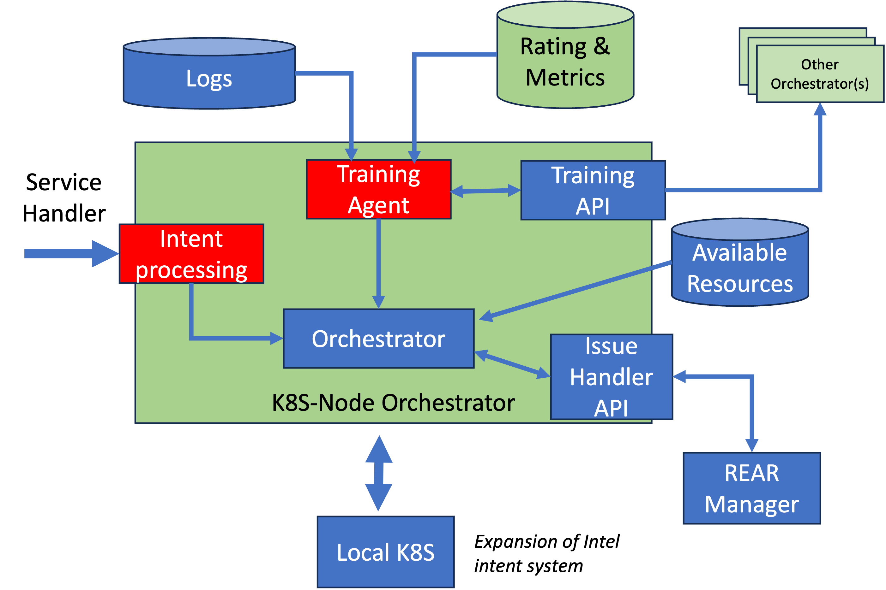

# Node Orchestrator

<i>D2.1 Definition</i>

> The node orchestrator is the FLUIDOS module responsible for the orchestration of the service
requests, either on the local node, or offloading them to a remote FLUIDOS node, based on
the current snapshot of the available resources database. Additionally, it interacts with and
coordinates other components, mainly the resource acquisition manager, to trigger the
acquisition of new resources and the setup of the appropriate network and storage fabrics
enabling transparent execution continuum, in case already available ones are not sufficient to
satisfy the incoming request.

The node orchestrator is responsible for finding the best suitable place to allocate the policy/intent provided by the [Service Handler](service-handler.md) and performing the enforcement and the proactive reactions. The allocation is achieved using different orchestration algorithms such as ILP, Greedy, etc. If there are no resources available, then the Node Orchestrator triggers the [REAR Manager](https://github.com/fluidos-project/node/blob/main/docs/implementation/components.md#rear-manager). When the Node Orchestrator has new resources, it performs the peering and the offloading of the service to the remote resources. Additionally, the Node Orchestrator can make reactive reactions when triggered by the [Local Telemetry Service](../../fluidos_node_implementation/main_functional_elements/local_telemetry_service.md) or the [Privacy and Security Manager](../../security/main_functional_elements/privacy_and_security_manager.md) in case of a SSLA violation, overload, lack security, etc.

## Workflow

## Node Orchestrator Implementations

Different implementations depending on the intent language are supported.

### Node Orchestrator - K8S

* Vanilla K8S 

### Node Orchestrator – K8S with intent processing

* Intel intent [format](https://github.com/intel/intent-driven-orchestration/blob/main/docs/framework.md)
* Intent Processing and Training Agent components are modified with respect to the intent format

### MSPL Node Orchestrator 

* MSPL-based intent format

