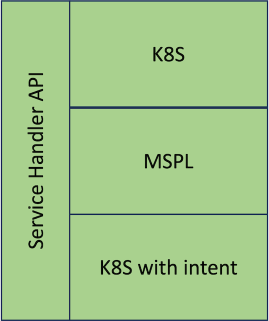

# Service Handler

 

The Service Handler is the component that acts as the entrypoint in the architecture. It is in charge of validating and forwarding the request to the correct [Node Orchestrator](./node-orchestrator.md), based on the type of the intent:

 - Vanilla k8s spec
 - MSPL
 - K8s with intent

