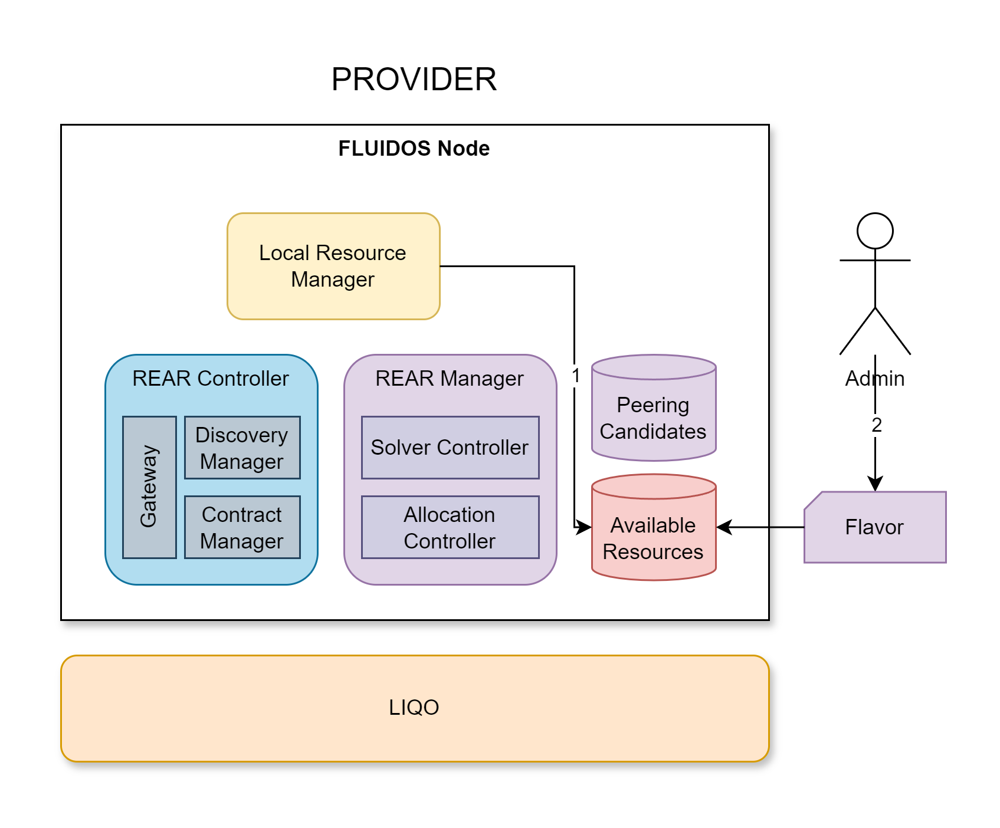

# Step 1: Resource Discovery and Creation

&#8617; [Index](../../two_nodes.md)

When the FLUIDOS Node starts, it will first look for the resources that are available in the cluster. The resources can be any type of Flavor supported (e.g. Kubernetes Slice, Virtual Machines, etc). Once found they are stored in the cluster as instances of the Flavor Custom Resource Definition (CRD).

---
The **Flavor** is a Kubernetes Custom Resource Definition, and the set of its instances stored into the cluster is the so-called **Available Resources**.

---
The **Local Resource Manager** (LRM) is the component in charge of this task **(1)**. Concerning the Kubernetes Slice, the LRM will look for all the Kubernetes worker nodes which are labeled as `node-role.fluidos.eu/resources: "true"`. All of them are mapped as Flavor. Example:

- **Flavor 1** from Node 1:
  - 10 CPUs
  - 128 GB of RAM
  
- **Flavor 2** from Node 2:
  - 12 CPUs
  - 256 GB of RAM

Since the Flavor is a CR, it can be created, edited, and deleted by a cluster admin (2). The Flavor CRD is defined in the `flavor-crd.yaml` file.

---
NEXT STEP: [Step 2: Resource Selection](./02_intent_creation.md)
