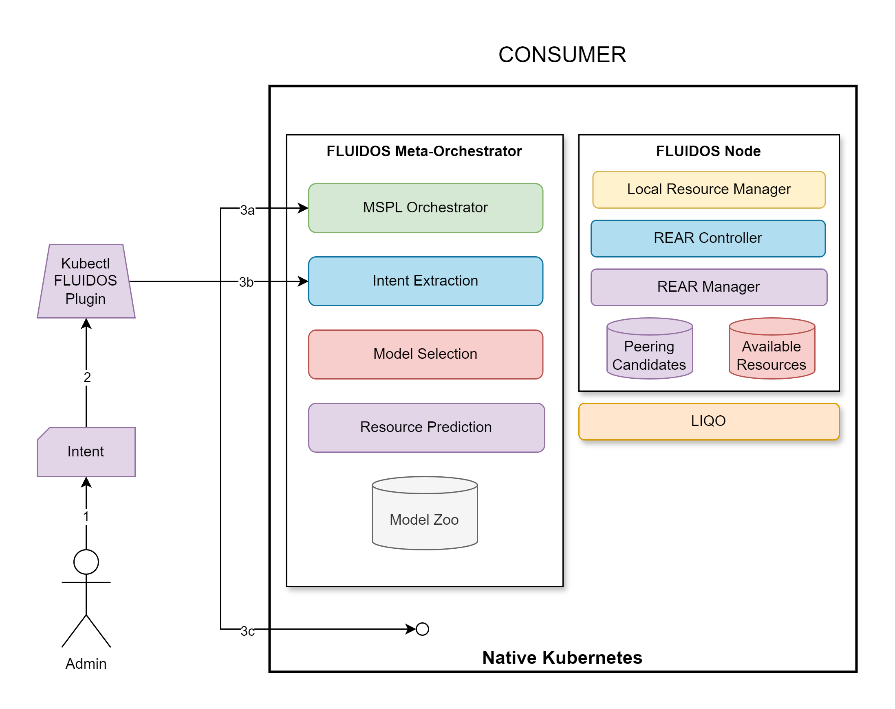

# Step 2: Intent Creation

&#8617; [Index](../../two_nodes.md)

In this step the real interaction with FLUIDOS starts. Everything begins with the **Intent**.

---
An **Intent** is a Kubernetes Custom Resource Definition (CRD) that represents the user's request for what it wants to get in the cluster. Example:

- **Intent**:
  - Execute App
    - Deployed in a cluster in Italy
    - With a specific throughput
  - Use a message broker
    - Deployed in the local cluster

An Intent can be defined in multiple ways:

- MSPL
- Kubernetes deployment
- FLUIDOS deployment
- Snippet of text

---
The Intent is created by a user (1).

Then, it is submitted to the cluster through the **kubectl FLUIDOS plugin** (2).

This plugin is in charge of distinguishing the Intent type and to direct it to the correct consumer in the meta-orchestrator (3a/3b/3c). The meta-orchestrator is the component in charge of translate the Intent into actual workloads according to the specification inside the Intent.

In case of an Intent of type:

- MSPL: the plugin will send it to the MSPL orchestrator (3a).
- FLUIDOS deployment: the plugin will send it to the Intent extraction (3b).
- Kubernetes deployment: the plugin will send it to the native kubernetes and the native environment will take care of the deployment (3c).

---
PREVIOUS STEP: [Step 1: Resource Discovery](./01_resource_detection.md) | NEXT STEP: [Step 3: Model Retrieval](./03_model_retrieving.md)
