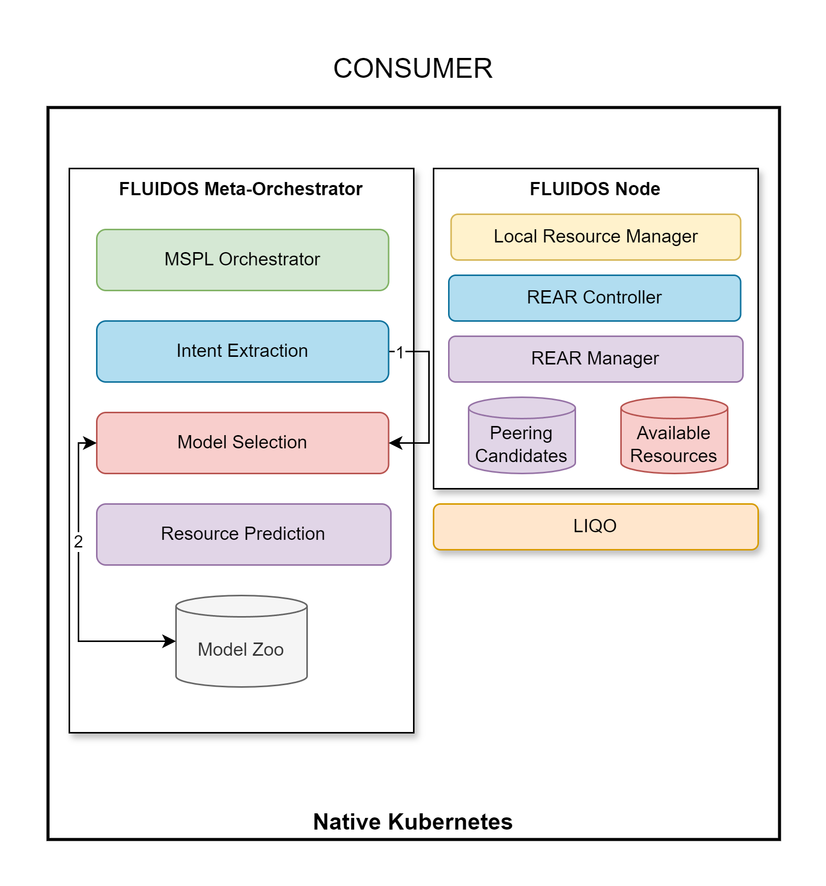

# Step 3: Retrieve the Meta-orchestrator Model

&#8617; [Index](../../two_nodes.md)

Once the intent is extracted, the **model selection** is triggered (2).

This step is responsible for retrieving the meta-orchestrator model from the **Model Zoo** (2). The appropriate model is selected based on the intent extracted in the previous step.

The model is used for the resource prediction of the further steps.

---
PREVIOUS STEP: [Step 2: Resource Discovery](./02_intent_creation.md) | NEXT STEP: [Step 4: Determine required resources](./04_determine_resources.md)
