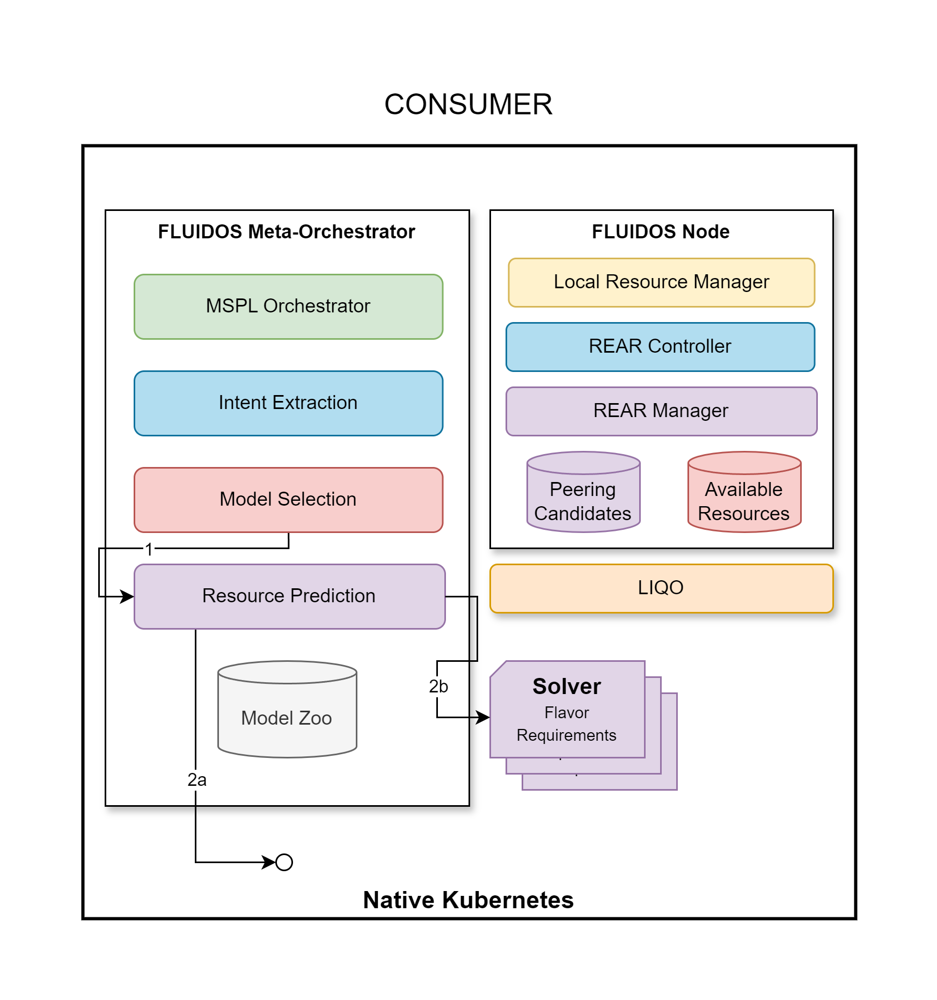

# Step 4: Determine Required Resources

&#8617; [Index](../../two_nodes.md)

Once the meta-orchestrator has chosen the model, it is time to determine the *resources* required to satisfy the user's intent (1).

---
Resources are like Flavors:

- *Computational* Resources
- *Software as a Service* Resources
- *DataStream* Resources
- *Dataset* Resources

---
Once determined the needed set of resources, these are requested:

- **Locally** (2a): the resources are already available in the cluster or can be easily created in the cluster.

- **Remotely** (2b): the resources are not available in the cluster and need to be requested from a remote cluster, another FLUIDOS Node.

  - The remote resource request is made by the creation of one or more **Solver CRs**.

---
PREVIOUS STEP: [Step 3: Model Retrieval](./03_model_retrieving.md) | NEXT STEP: [Step 5: Solver Creation](./05_solver_creation.md)
