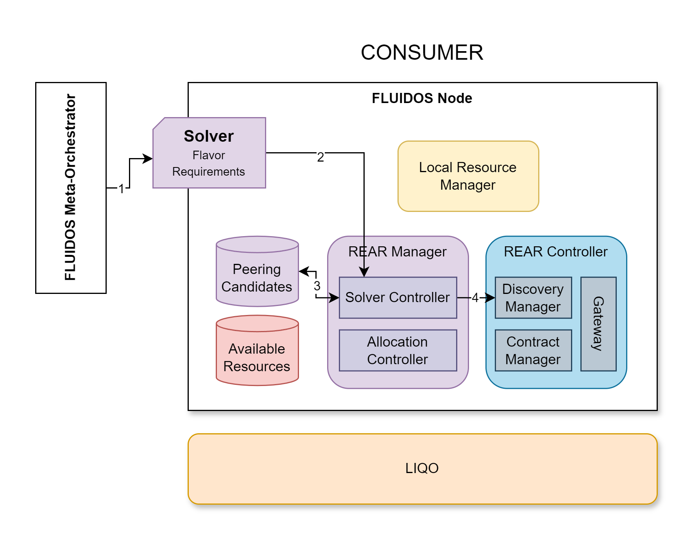

# Step 5: Solver Creation

&#8617; [Index](../../two_nodes.md)

In this step, the FLUIDOS Node is triggered by the meta-orchestrator through the Solver CR.

---
The Solver is a Kubernetes Custom Resource (CR) that contains the information about the Flavor and its specific requirements to be found. Example:

- Solver1:
  - Flavor: 'k8slice'
  - Requirements:
    - minCPU: 2
    - minMemory: 4Gi
    - minPods: 2

---
The Solver is created by the meta-orchestrator (1).

The creation of this specific custom resource triggers a specific component of the FLUIDOS Node, the REAR Manager, specifically the Solver Controller (2).

The first task of the Solver Controller is to check if there is any already known Peering Candidate stored that can be used to solve the Solver requirements (3).

If there is no Peering Candidate stored, the Solver Controller will trigger the Discovery Manager to start the discovery process (4).

---
PREVIOUS STEP: [Step 4: Model Retrieval](./03_model_retrieving.md) | NEXT STEP: [Step 6: Node Discovery and remote nodes contact](./06_discovery.md)
