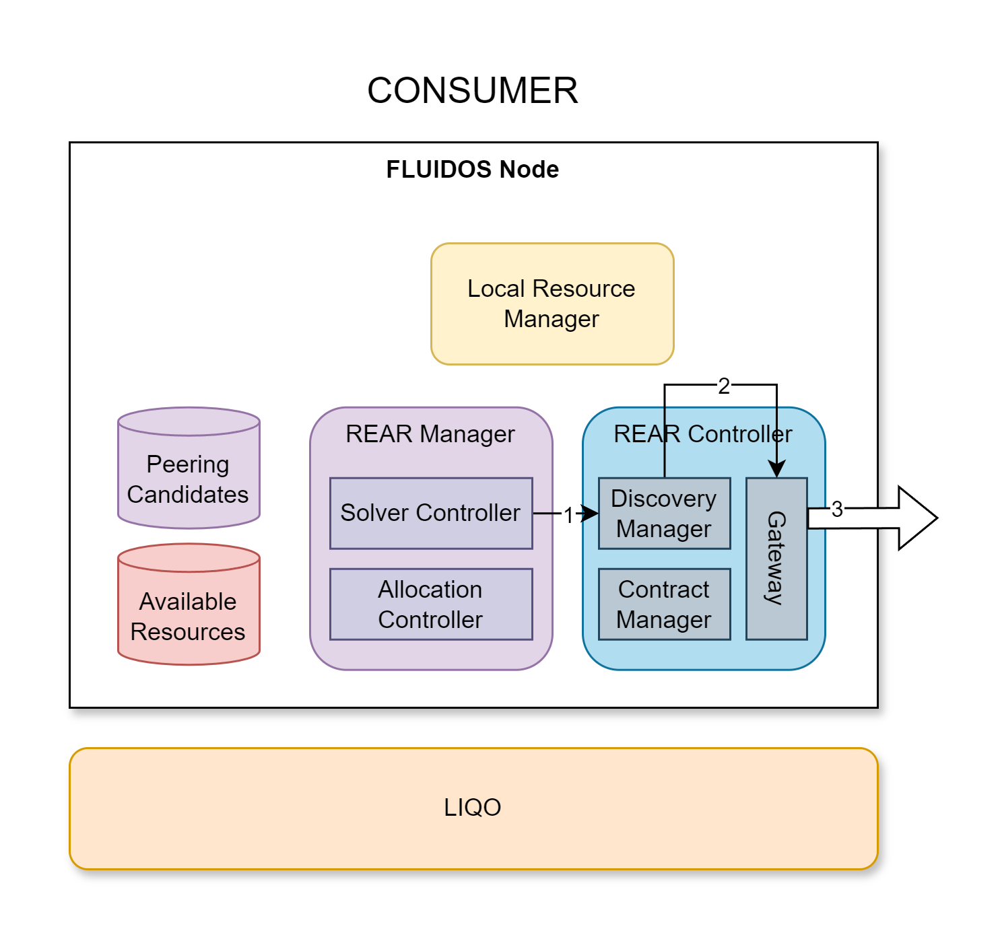

# Step 6: Node Discovery and Remote Nodes Contact

&#8617; [Index](../../two_nodes.md)

The discovery phase is started by the Solver Controller triggering the **Discovery Manager** (1). Essentially, the Discovery Manager is responsible for contacting all the previously known FLUIDOS Nodes.

The set of FLUIDOS Nodes and their IP addresses to contact is stored in a ConfigMap in the cluster. This ConfigMap will be populated by the NetworkManager, currently is written by hand by the cluster administrator.

The Discovery Manager will contact all the FLUIDOS Nodes using the **Gateway** (2).

The **Gateway** is a component acting on the consumer side as a *REAR client*. Details of the REAR protocol and exchanged messages are not reported here. The Gateway will contact the FLUIDOS Nodes to ask for (all/suitable) flavors (3).

---
PREVIOUS STEP: [Step 5: Solver Creation](./05_solver_creation.md) | NEXT STEP: [Step 7: Flavor retrieve - Provider side](./07_flavor_retrieve_provider.md)
