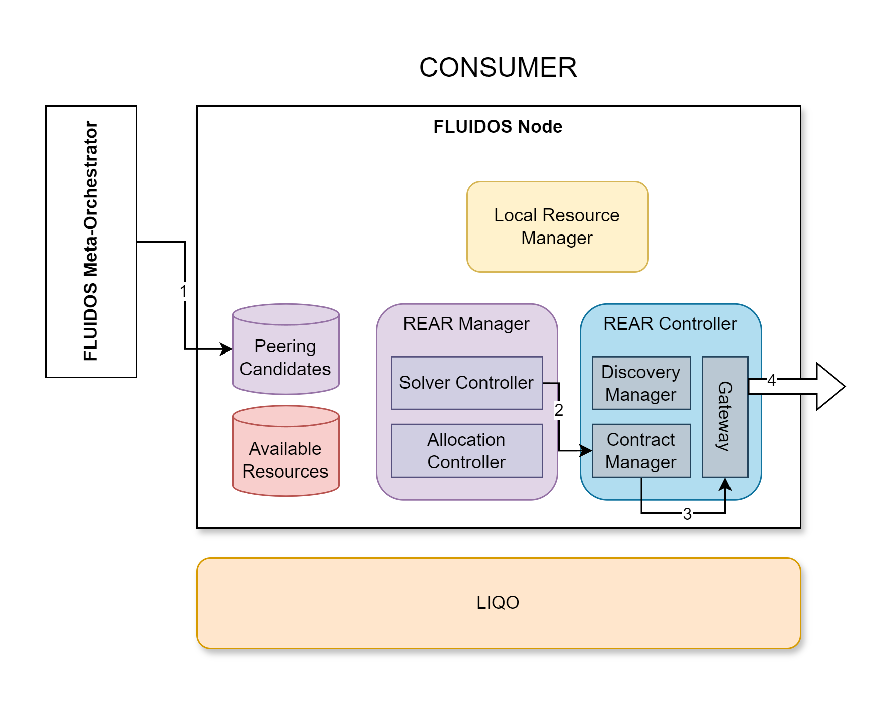

# Step 9: Flavor Reservation - Consumer side

&#8617; [Index](../../two_nodes.md)

The FLUIDOS Meta-Orchestrator checks when the *discovery phase* is solved. This status can be checked by the previously custom resource it created, the Solver. This means that now there are compatible PeeringCandidates in the cluster that can be used, therefore the FLUIDOS Meta-Orchestrator request to *reserve* all the compatible ones (1).

The Solver Controller detects the reservation request associated to the Solver and starts the reservation process through the **Contract Manager** (2).

The **Contract Manager** *reserves* the selected flavors through the Gateway (3) and the REAR Protocol (4).

---
PREVIOUS STEP: [Step 8: Flavor Retrieve - Consumer side](./08_flavor_retrieve_consumer.md) | NEXT STEP: [Step 10: Flavor reservation - Provider side](./10_flavor_reservation_provider.md)
