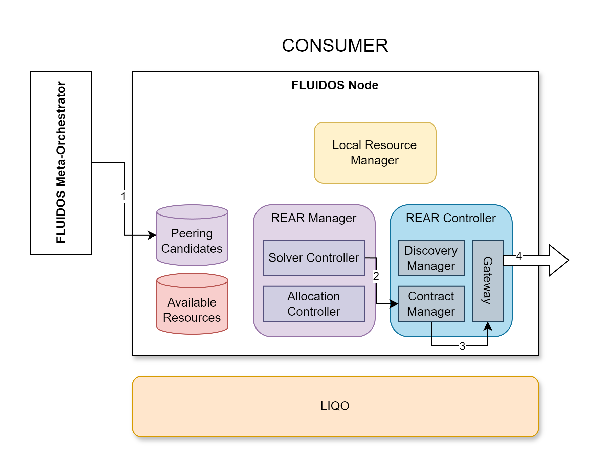

# Step 11: Flavor Purchase - Consumer side

&#8617; [Index](../../two_nodes.md)

The FLUIDOS Meta-Orchestrator decides which specific Flavor and related PeeringCandidate to buy. This decision is based on the logic of the model chosen before ([Step 3: Retrieve the Meta-orchestrator Model](./03_model_retrieving.md)) and the metrics gathered by the flavors. Therefore a specific PeeringCandidate is set to be bought by the meta-orchestrator (1).

The Solver-Controller detects to purchase a PeeringCandidate and triggers the Contract Manager to *purchase* the Flavor (2).

The Contract Manager, using the REAR protocol, asks the provider to *purchase* the specific Flavor (3).

---
The Flavor traded in this step has to be necessarily previously reserved.

---
PREVIOUS STEP: [Step 10: Flavor Reservation - Provider side](./10_flavor_reservation_provider.md) | NEXT STEP: [Step 12: Flavor purchase - Provider side](./12_flavor_purchase_provider.md)
