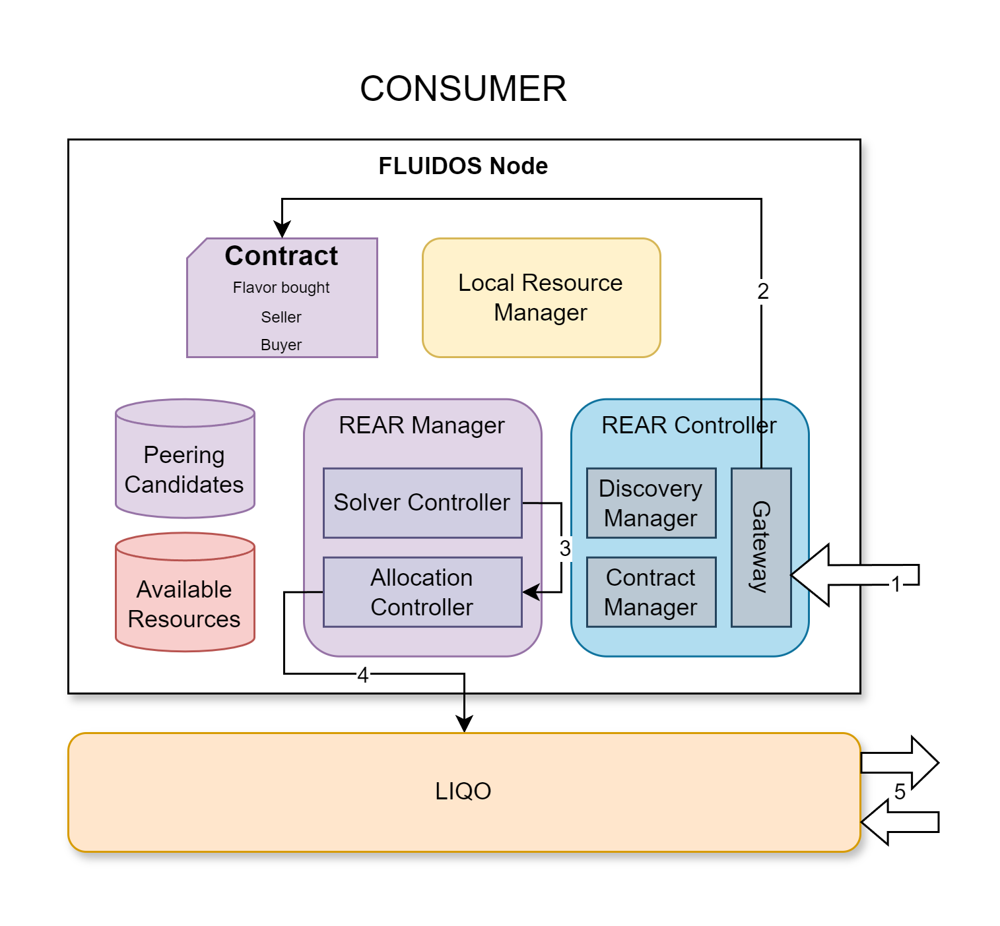

# Step 13: Peering Establishment - Consumer side

&#8617; [Index](../../two_nodes.md)

The Gateway on the consumer receives the **Contract** from the provider (1).

The Contract is stored in the cluster (2).

The Solver Controller detects that the purchase phase is completed and triggers the **Allocation Controller** to establish the peering based on the Contract information just received (3).

---
The **Allocation Controller** is the component in charge of communicating to **Liqo** the desire to establish a peering with the provider. It uses the **Liqo** CRDs to start the peering establishment process.

---
The Allocation Controller communicates with the **Liqo** module to establish the peering (4).

**Liqo** can now proceed to communicate with the other FLUIDOS Node Liqo module to establish the peering (5).

---
PREVIOUS STEP: [Step 12: Flavor Purchase - Provider side](./12_flavor_purchase_provider.md) | NEXT STEP: [Step 14: Peering Establishment - Provider side](./14_peering_establishment_provider.md)
