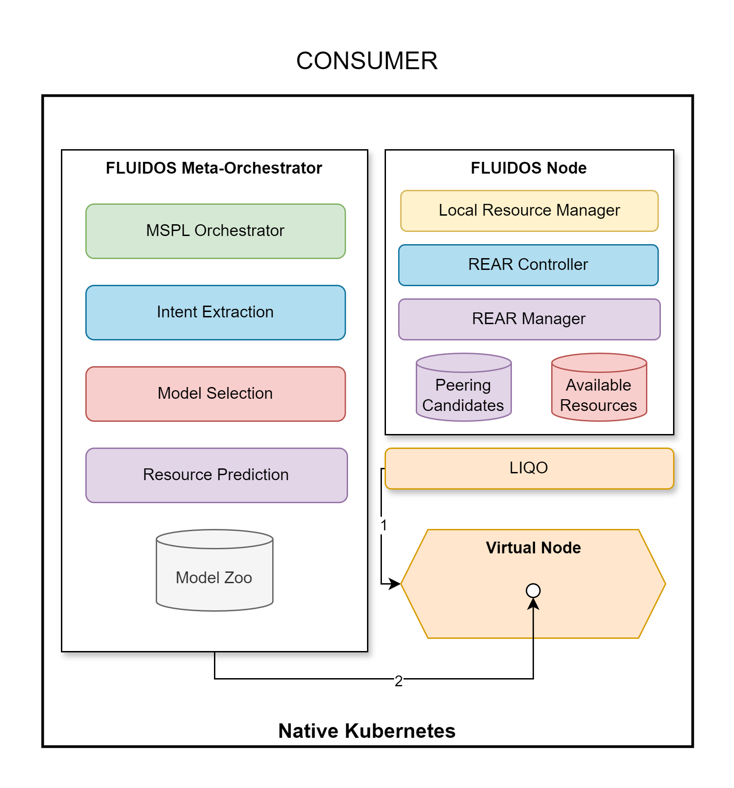

# Step 15: Liqo Offloading

&#8617; [Index](../../two_nodes.md)

Once established the peering, the Liqo module on the consumer side provides to create the **Virtual Node** in the consumer Kubernetes cluster (1).

The FLUIDOS Meta-Orchestrator can now schedule the workload planned to be offloaded to the remote node into the **Virtual Node**. This is achieved by creating a **Pod** in the consumer cluster and scheduling it to the **Virtual Node** (2).

---
PREVIOUS STEP: [Step 14: Peering Establishment (Provider side)](./14_peering_establishment_provider.md)
