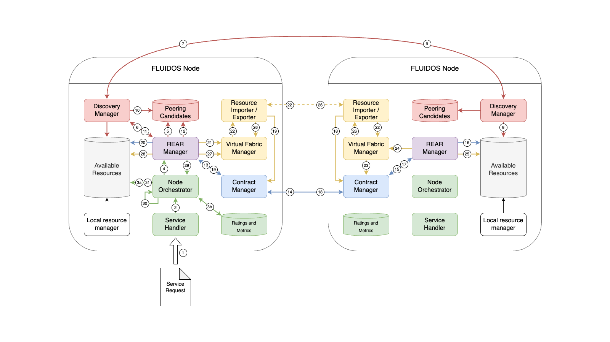

# Two nodes, same domain

## Steps

1. A new _service request_ is sent to the **[Service Handler](../../main_activities/intentbased_computing_continuum/main_functional_elements/service-handler.md)** in the form of an _intent_.
2. The _intent_ is passed to the **[Node Orchestrator](../../main_activities/intentbased_computing_continuum/main_functional_elements/node-orchestrator.md)**, which translates and decomposes it to simple _resources or services requests_.
3. The **Node Orchestrator** looks up for _flavours_ matching the _request_ in the **[Available Resources](../../main_activities/fluidos_node_implementation/main_functional_elements/available_resources.md)** and the **[Ratings and Metrics](../../main_activities/fluidos_node_implementation/main_functional_elements/ratings_and_metrics.md)** tables.
4. In case there are no suitable available resources, the _request_ is passed to the **[REAR Manager](../../main_activities/fluidos_node_implementation/main_functional_elements/rear_manager.md)** to start-up the Discovery, Reservation and Peering phases.
5. The **REAR Manager** looks up in the **[Peering Candidates](../../main_activities/fluidos_node_implementation/main_functional_elements/peering_candidates.md)** table for potential peering candidates (suitable _flavours_) matching the _request_.
6. In case there are no suitable peering candidates, the the **REAR Manager** builds a _flavour selector_ and passes it to the **[Discovery Manager](../../main_activities/fluidos_node_implementation/main_functional_elements/discovery_manager.md)** asking for a suitable peering candidate.
7. The **Discovery Manager** of the Consumer Node sends a _LIST_FLAVOURS_ message to all the endpoints it already knows, whatever they are local Nodes, a Supernode or a Catalog.
8. The **Discovery Manager** of the Provider Node looks-up for suitable local _flavours_ matching the received _flavour selector_ in its **Available Resources** table.
9. In case one or more suitable _flavours_ are found, the **Discovery Manger** of the Provider Node sends back an OK message to the **Discovery Manager** of the Consumer Node attaching the _flavours_ list.
10. The **Discovery Manager** of the Consumer Node populates the **Peering Candidates** table with the newly discovered _flavours_.
11. It then informs the **REAR Manager** that the Discovery phase has completed successfully.
12. See <u>step #5</u>.
13. Now that a suitable peering candidate is found, the **REAR Manager** asks the **[Contract Manager](../../main_activities/fluidos_node_implementation/main_functional_elements/contract_manager.md)** to start-up the Reservation phase pointing to the Provider Node.
14. The **Contract Manager** of the Consumer Node sends a _RESERVE_FLAVOUR_ message to the **Contract Manager** of the Provider Node.
15. The **Contract Manager** of the Provider Node creates a new _contract_ and asks its **REAR Manager** to reserve resources for the incoming request.
16. The **REAR Manager** updates the **Available Resources** table by deleting the old advertised _flavour_ and creating a new reduced _flavour_ (suitable for other future requests) and by creating a new _allocation_ of type "Node" in "inactive" status.
17. The **REAR Manager** informs the **Contract Manager** that the resources have been reserved.
18. The **Contract Manager** of the Provider Node answers back to the **Contract Manager** of the Consumer Node with an _OK_ message. At the same time an informer makes the **[Network Manager](../../main_activities/fluidos_node_implementation/main_functional_elements/network_manager.md)** aware, so that it can deploy a virtual router to enable peering reachability.

Following the steps defined into the REAR Protocol, the two **Contract Managers** may exchange a couple of other messages to confirm the reservation on both sides, but may also directly agree following the procedure described from <u>step #14</u> to <u>step #18</u>.

19. The **Contract Manager** of the Consumer Node creates a new _contract_ and informs its REAR Manager that the resources have been reserved. At the same time an informer makes the **Network Manager** aware, so that it can deploy a virtual router to enable peering reachability.
20. The **REAR Manager** updates the **Available Resources** table by creating a new _allocation_ of type "VirtualNode" in "inactive" status.

Now the flow changes a little bit according to the release of Liqo. The current available release provides an "External Resource Monitor" to intercept incoming peering requests so to allocate resources based on the CustomerID available in the request. This mechanism has a clear limitation: only a single peering can be established per each couple of Nodes, since the discriminator is the CustomerID of the cluster. Instead with the next release of Liqo, which will provide a declarative way of defining Virtual Nodes, this limitation will be overcome.

21. The **REAR Manager** solicits its **[Virtual Fabric Manager](../../main_activities/fluidos_node_implementation/main_functional_elements/virtual_fabric_manager.md)** (LIQO) to set-up the peering.
22. The **Virtual Fabric Manager** of the Consumer Node generates a ResourceRequest on the **Virtual Fabric Manager** of the Provider Node. Network reachability is provided by the **Network Managers**.
23. The **Virtual Fabric Manager** of the Provider Node looks up in its **Contract Manager** for an already signed contract embedding a _flavour_ matching the CustomerID of the Consumer Node: once found, it completes the peering.
24. Once done, an informer makes the **REAR Manager** aware.
25. The **REAR Manager** updates the **Available Resources** table by putting the previously created _allocation_ to "active" state.
26. The **Virtual Fabric Manager** of the Provider Node sends a ResourceOffer to the **Virtual Fabric Manager** of the Consumer Node.
27. See <u>step #24</u>.
28. See <u>step #25</u>.
29. The **REAR Manager** finally informs the **Node Orchestrator** that all the Discovery, Reservation and Peering phases are over.
30. The **Node Orchestrator** is auto-solicited to continue with the Intent Management phase.
31. See <u>step #3</u>

Now that there are available resources that fulfill the request, the **Node Orchestrator** can finally deploy the workload described in the _intent_ exploiting standard Kubernetes primitives and pointing to the VirtualNode retrieved in the **Available Resources** table.